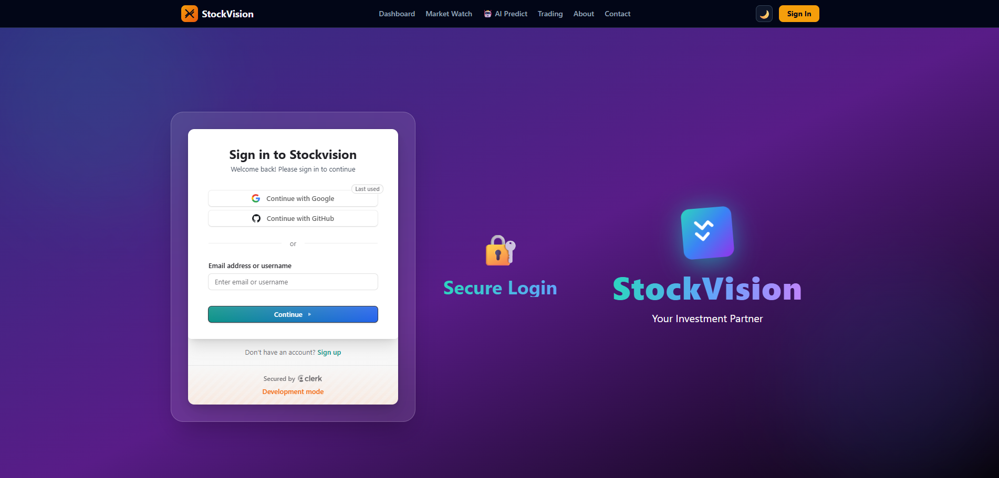

# 📈 StockVision - AI-Powered Investment Platform

<div align="center">
  
  
  
  
</div>

<p align="center">
  <strong>A modern, AI-driven stock market analysis platform with real-time insights, predictive analytics, and portfolio management.</strong>
</p>




## 🎯 Use Case

StockVision is designed for **retail investors, traders, and financial enthusiasts** who want to:

- 📊 **Track market movements** in real-time with actionable BUY/SELL signals
- 🤖 **Predict stock prices** using AI-powered algorithms with confidence scoring
- 💼 **Manage portfolios** with comprehensive performance tracking and P&L reports
- 📈 **Plan investments** with interactive calculators and growth projections
- 📉 **Analyze trends** with advanced charting and market watch capabilities

### Target Users:
- **Beginner Investors**: Easy-to-understand signals and predictions
- **Active Traders**: Real-time market watch with sorting capabilities
- **Portfolio Managers**: Comprehensive dashboard with allocation insights
- **Financial Planners**: Investment calculators and projection tools

---

## ✨ Features

### 🤖 AI Stock Predictor
- Select from 8 major stocks (AAPL, GOOGL, TSLA, MSFT, AMZN, NVDA, META, NFLX)
- AI-powered 30-day price predictions with confidence scores
- Historical vs. predicted data visualization
- Trading signals (BUY/SELL) with risk assessment
- Market trend analysis (Bullish/Bearish)

### 📊 Market Watch
- Real-time stock data for 10 major companies
- **Sort by Top Gainers** or **Top Losers** with one click
- Color-coded BUY/SELL signals
- Trend indicators (▲▼) for quick visual analysis
- Volume and price change tracking

### 💼 Personal Dashboard
- User profile with avatar and membership details
- Portfolio performance chart (6-month trend)
- Portfolio allocation pie chart
- Recent transactions history
- Monthly P&L (Profit & Loss) reports
- Key metrics: Total Invested, Current Value, Total Return

### 📈 Investment Planner
- Interactive sliders for customization:
  - Initial investment amount
  - Monthly contributions
  - Annual return rate (%)
  - Investment duration (years)
- Real-time growth projections with line charts
- Breakdown of invested vs. returns
- Inflation adjustment option

### 🎨 Modern UI/UX
- **Dark mode by default** with light mode toggle
- Smooth animations powered by Framer Motion
- Responsive design for all screen sizes
- Glassmorphic cards with backdrop blur
- Amber accent colors for a unique brand identity

---

## 🛠️ Tech Stack

### Frontend
| Technology | Purpose | Version |
|------------|---------|---------|
| **React** | UI Framework | 18.3.x |
| **Vite** | Build Tool & Dev Server | 5.x |
| **TailwindCSS** | Styling & Design System | 3.4.x |
| **Framer Motion** | Animations & Transitions | 11.x |
| **React Router** | Client-side Routing | 6.x |
| **Recharts** | Data Visualization | 2.x |

### Authentication & Security
| Technology | Purpose |
|------------|---------|
| **Clerk** | User Authentication & Management |
| **OAuth** | Social Login (Google, GitHub) |

### Utilities & Tools
- **Lucide React** - Icon library
- **PostCSS** - CSS processing
- **ESLint** - Code linting

---

## 🚀 Getting Started

### Prerequisites

Before you begin, ensure you have the following installed:
- **Node.js** (v18 or higher) - [Download](https://nodejs.org/)
- **npm** or **yarn** package manager
- **Git** - [Download](https://git-scm.com/)

### Installation

1. **Clone the repository**
   ```bash
   git clone https://github.com/yourusername/stockvision.git
   cd stockvision
   ```

2. **Install dependencies**
   ```bash
   npm install
   # or
   yarn install
   ```

3. **Set up environment variables**

   Create a `.env` file in the root directory:
   ```env
   VITE_CLERK_PUBLISHABLE_KEY=your_clerk_publishable_key_here
   ```

   **How to get Clerk API key:**
   - Sign up at [clerk.com](https://clerk.com)
   - Create a new application
   - Copy the **Publishable Key** from the dashboard
   - Paste it in your `.env` file

4. **Enable Google OAuth (Optional)**
   - Go to Clerk Dashboard → **User & Authentication** → **Social Connections**
   - Toggle **Google** to enable
   - Save changes

5. **Run the development server**
   ```bash
   npm run dev
   # or
   yarn dev
   ```

6. **Open your browser**
   
   Navigate to `http://localhost:5173`

---

## 📱 Usage

### Authentication Flow

1. **Sign Up / Sign In**
   - Navigate to `/login` or click "Sign In" in navbar
   - Use email/password or Google OAuth
   - Create your account in seconds

2. **Access Protected Routes**
   - After authentication, access all features:
     - Dashboard (`/dashboard`)
     - AI Predict (`/ai-predict`)
     - Market Watch (`/market-watch`)
     - Future Trading (`/future`)

### Using AI Predictions

1. Navigate to **AI Predict** from navbar
2. Select a stock from the dropdown (e.g., AAPL)
3. Click **🤖 Predict** button
4. Wait 2 seconds for AI processing
5. View results:
   - Current vs. Predicted price
   - Confidence score
   - Interactive chart
   - Trading signals
   - Risk assessment

### Market Watch

1. Navigate to **Market Watch**
2. View 10 stocks with real-time data
3. Click **📈 Top Gainers** to sort by highest gains
4. Click **📉 Top Losers** to sort by biggest losses
5. Check BUY/SELL signals and trend arrows

### Dashboard Overview

1. Navigate to **Dashboard**
2. View your profile and stats
3. Analyze portfolio performance chart
4. Check allocation pie chart
5. Review recent transactions
6. Monitor P&L reports

### Investment Planning

1. Go to **Home** page
2. Use sliders to adjust:
   - Initial amount
   - Monthly contribution
   - Expected return rate
   - Investment period
3. View projected growth in real-time
4. Analyze breakdown of returns vs. invested amount

---


### Typography

- **Font Family**: System UI, -apple-system, Segoe UI, Roboto
- **Headings**: Bold, 2xl to 5xl
- **Body**: Regular, sm to lg
- **Currency**: Pakistani Rupees (Rs)

---

## 📂 Project Structure

```
stockvision/
├── public/
|   ├── uraan-logo.png
│   └── vite.svg
├── src/
│   ├── Components/
|   |   ├── Hero.jsx
|   |   ├── InvesttmentCard.jsx
|   |   ├── ProtectedRoute.jsx
│   │   ├── Navbar.jsx              # Navigation bar with auth
│   │   ├── Footer.jsx              # Footer with links
│   │   ├── StockTable.jsx          # Market overview table
│   │   └── EarningGraph.jsx        # Growth chart component
│   ├── pages/
│   │   ├── Home.jsx                # Investment calculator & stats
│   │   ├── Dashboard.jsx           # User portfolio dashboard
│   │   ├── AiPredict.jsx           # AI stock predictor
│   │   ├── MarketWatch.jsx         # Market watch with sorting
│   │   ├── FutureTrading.jsx       # Futures & options
│   │   ├── About.jsx               # Company information
│   │   ├── Contact.jsx             # Contact form
│   │   ├── Login.jsx               # Authentication - Sign in
│   │   └── Signup.jsx              # Authentication - Sign up
│   ├── data/
│   │   └── stocks.js               # Sample stock data
│   ├── App.jsx                     # Main app component
│   ├── main.jsx                    # Entry point
│   └── index.css                   # Global styles + light mode
├── .env                            # Environment variables
├── package.json                    # Dependencies
├── vite.config.js                  # Vite configuration
├── tailwind.config.js              # Tailwind configuration
└── README.md                       # This file
```

---

## 🔧 Configuration

### Tailwind Configuration

Custom colors and theme extensions are defined in `tailwind.config.js`:

```javascript
theme: {
  extend: {
    colors: {
      slate: { /* custom slate shades */ },
      amber: { /* custom amber shades */ }
    }
  }
}
```

### Vite Configuration

Optimized build and dev server settings in `vite.config.js`:

```javascript
export default {
  plugins: [react()],
  server: {
    port: 5173
  }
}
```

---

## 🌐 Deployment

### Deploy to Vercel (Recommended)

1. Push your code to GitHub
2. Go to [vercel.com](https://vercel.com)
3. Click "New Project"
4. Import your repository
5. Add environment variable:
   ```
   VITE_CLERK_PUBLISHABLE_KEY=your_key
   ```
6. Click "Deploy"

### Deploy to Netlify

1. Build the project:
   ```bash
   npm run build
   ```
2. Deploy the `dist` folder to Netlify
3. Add environment variables in Netlify dashboard

---

## 🤝 Contributing

Contributions are welcome! Please follow these steps:

1. Fork the repository
2. Create a feature branch (`git checkout -b feature/AmazingFeature`)
3. Commit your changes (`git commit -m 'Add some AmazingFeature'`)
4. Push to the branch (`git push origin feature/AmazingFeature`)
5. Open a Pull Request

---

## 📝 Roadmap

- [ ] Connect to real-time stock API (Alpha Vantage)
- [ ] Implement backend with Node.js + Express
- [ ] Add PostgreSQL/MongoDB database
- [ ] Real AI model with TensorFlow
- [ ] Email notifications for price alerts
- [ ] Social trading features (follow traders)
- [ ] Mobile app (React Native)
- [ ] Cryptocurrency trading support
- [ ] Options strategy builder
- [ ] Paper trading mode

---

## 📄 License

This project is licensed under the **MIT License** - see the [LICENSE](LICENSE) file for details.

---


## 🏢 Built By

<div align="center">
  <h3>Uraan Studios</h3>
  <p>Innovative Software Development Studio</p>
  <p>
    <a href="https://uraanstudios.vercel.app">Website</a> •
    <a href="https://github.com/uraan-studios">GitHub</a> •
    <a href="mailto:support@uraanstudios.com">Email</a>
  </p>
</div>
---

## ⭐ Star This Repository

If you find this project useful, please consider giving it a ⭐ on GitHub!

<div align="center">
  <p>Made with ❤️ by Uraan Studios</p>
  <p>© 2024 StockVision. All rights reserved.</p>
</div>